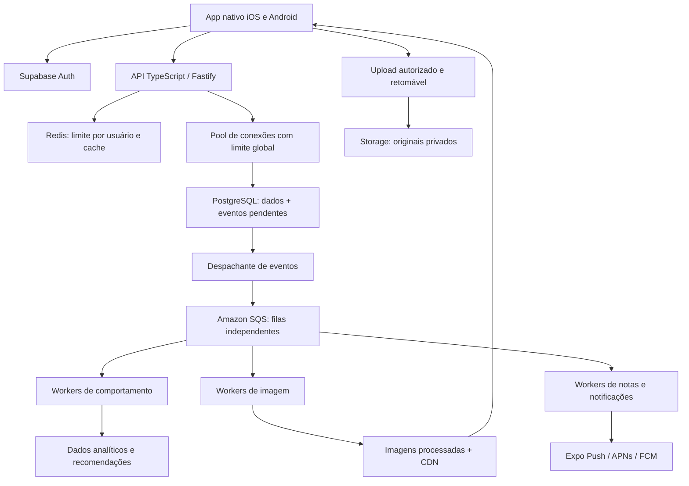

# Tasty nativo — proposta para alinhamento

Data: 12 de setembro de 2026. Este documento descreve uma arquitetura proposta, ainda não implementada nem validada por teste de carga. A alteração de cores na versão web é uma entrega independente.

## Decisões já recebidas

- Identidade visual: substituir verde por vermelho. Cor principal `#C62828`, variação escura `#991F1F`, fundos claros em tons de vermelho e creme. Aplicar também ao novo app nativo.
- Meta de pico aprovada pelo usuário: **10.000 cadastros e 10.000 avaliações durante o mesmo minuto**.
- Gatilho provisório aprovado para avaliar ML: **50.000 interações válidas, 2.000 usuários ativos e 8 semanas de dados**, além de demonstrar melhoria sobre as recomendações por regras.
- Construir o app nativo em um projeto novo. A versão web será referência de produto e modelo de dados, sem copiar sua estrutura React DOM, Vite ou CSS como base do aplicativo.

Os seis pontos abaixo ainda precisam de alinhamento antes de iniciar a implementação nativa, conforme solicitado no prompt anexado.

## 1. Stack: comparação e recomendação

| Critério                           | React Native + Expo com build próprio                                   | Swift/SwiftUI + Kotlin/Jetpack Compose                                      |
| ---------------------------------- | ----------------------------------------------------------------------- | --------------------------------------------------------------------------- |
| Aplicativo entregue                | Binários iOS e Android com componentes e módulos nativos                | Dois aplicativos construídos diretamente com as ferramentas das plataformas |
| Linguagens                         | TypeScript, com Swift/Kotlin onde houver módulos específicos            | Swift no iOS e Kotlin no Android                                            |
| Interface e regras de apresentação | Grande parte compartilhada                                              | Implementação e manutenção por plataforma                                   |
| Câmera e OCR                       | Módulos nativos; integrações próprias quando necessário                 | Acesso direto às APIs de cada sistema                                       |
| Push e background                  | APIs nativas por módulos; sujeitos às mesmas restrições dos sistemas    | APIs acessadas diretamente, com as mesmas restrições dos sistemas           |
| Manutenção                         | Menor duplicação; exige testar compatibilidade das dependências nativas | Maior controle; exige manter duas interfaces e integrações                  |
| Prazo e custo relativos            | Melhor ponto de partida para uma equipe pequena                         | Maior esforço total; duas equipes podem reduzir o prazo de calendário       |

**Recomendação: React Native com New Architecture, TypeScript e Expo em builds próprios de desenvolvimento e produção.** A interface será construída com componentes nativos, navegação e listas apropriadas para celular. Fabric e módulos nativos permitem integrar recursos da plataforma; Expo oferece ferramentas para compilar e distribuir esses projetos. Essas capacidades estão descritas na [arquitetura do React Native](https://reactnative.dev/architecture/landing-page) e nos [builds de desenvolvimento do Expo](https://docs.expo.dev/develop/development-builds/introduction/).

O produto não depende de uma interface com requisitos que justifiquem, neste momento, duplicar toda a implementação em Swift e Kotlin. Essa é uma avaliação de engenharia para este escopo, não uma garantia de que qualquer biblioteca atenderá sem adaptação. As versões exatas e a compatibilidade dos módulos serão fixadas na fase de viabilidade.

Para a Conta Justa, proponho OCR no dispositivo: Vision no iOS e ML Kit no Android, com uma interface comum e possibilidade de um módulo nativo próprio. A correção manual dos itens permanece obrigatória no fluxo. Ver [OCR do Vision](https://developer.apple.com/documentation/vision/recognizing-text-in-images?changes=lates_7) e [ML Kit Android](https://developers.google.com/ml-kit/vision/text-recognition/v2/android).

Credenciais de sessão usarão armazenamento seguro do sistema. Rascunhos, tarefas pendentes e cache local usarão SQLite. Mapas serão componentes nativos. O backend terá ambientes novos de desenvolvimento e homologação antes de qualquer migração da produção atual.

## 2. Backend para muitos usuários escrevendo ao mesmo tempo

### Desenho proposto

**Escrita curta e durável.** A publicação gravará a avaliação e um evento pendente na mesma transação, com chave de idempotência por usuário. A resposta de sucesso significará que o registro foi confirmado no banco. Repetir uma requisição após perda de conexão não criará outra avaliação. Processamento de fotos, agregação de notas e envio de push ocorrerão depois.

**Fila fora do banco principal.** Para a meta escolhida, proponho Amazon SQS Standard e workers em contêineres, inicialmente em ECS/Fargate na região mais próxima do banco. Um despachante publica os eventos pendentes do PostgreSQL e registra a confirmação. Se cair entre as duas ações, poderá reenviar: todos os consumidores precisarão de deduplicação e idempotência. Mensagens com falhas repetidas irão para filas de erro, com retentativas e alertas. SQS pode entregar mensagens repetidas ou fora de ordem, por isso não haverá promessa de processamento exatamente uma vez. [Semântica do SQS Standard](https://docs.aws.amazon.com/AWSSimpleQueueService/latest/SQSDeveloperGuide/standard-queues.html).

**Pooling.** API e workers usarão o pool transacional do Supabase, com conexões pequenas por instância e um teto global para impedir que o aumento de workers esgote o banco. Dimensionaremos também as conexões usadas por Auth, Storage e demais serviços. O cliente móvel usará HTTPS, sem conexão direta ao PostgreSQL. Configurações dependentes da sessão não serão mantidas entre transações. [Conexão e pooling no Supabase](https://supabase.com/docs/guides/database/connecting-to-postgres).

**Autorização e rate limiting.** A API validará o token, aplicará limites por usuário e endpoint em Redis e enviará `429` com orientação de retentativa quando necessário. Como ponto de partida: 10 avaliações/minuto por usuário com pequeno burst, 60 comentários/minuto e 120 ações de curtir/salvar por minuto, a ajustar após medição. A identidade será derivada do token validado, e as regras de propriedade também serão aplicadas no banco. Acesso direto às tabelas de escrita pelo cliente será fechado para impedir contornar a API. Papéis do banco terão privilégios mínimos e contexto de usuário limitado à transação. Limites e antifraude de cadastro serão tratados separadamente dos usuários autenticados.

**Cadastros.** Criar conta, enviar confirmação e confirmar o endereço são etapas diferentes. Usaremos Supabase Auth com SMTP de produção, limites negociados e monitoramento do provedor de e-mail. Apenas provisionamento mínimo de perfil ficará no caminho crítico; notificações e recomendações iniciais serão assíncronas. Pooling não elimina limites do serviço de autenticação nem de e-mail. [Limites de autenticação](https://supabase.com/docs/guides/auth/rate-limits).

**Fotos.** Upload direto ao storage por autorização temporária, compressão no aparelho e retomada após falhas. Os workers validarão os arquivos, removerão metadados desnecessários e produzirão tamanhos apropriados ao feed. Os originais permanecerão privados; imagens destinadas à publicação serão servidas pela CDN com caminhos versionados e política de invalidação. Proponho Supabase Storage com Smart CDN em plano compatível, sujeito a validar custos e quotas; a documentação descreve sua disponibilidade e cache. [Smart CDN](https://supabase.com/docs/guides/storage/cdn/smart-cdn).

**Notas, feed e jogos.** Agregados serão atualizados em lotes, incluindo edição/exclusão de avaliações, sem recontar todas as avaliações na requisição do usuário. Haverá reconciliação periódica. O feed usará paginação por cursor e cache de candidatos. Atualizações em tempo real serão restritas a salas e usuários interessados, com estado persistido e recuperação ao reconectar.

### Meta e teste de carga

10.000 cadastros/minuto equivalem a cerca de 167 cadastros/s; 10.000 avaliações/minuto a outros 167 salvamentos/s. São aproximadamente **334 operações de negócio/s**, antes de uploads, leituras, confirmação, curtidas e tracking. Não se deve interpretar esse total como apenas 334 consultas SQL/s.

Premissa inicial para o teste de mídia: uma foto comprimida de 2 MB por avaliação. Isso representa aproximadamente **20 GB recebidos em um minuto**, sem contar leituras pela CDN. É um envelope de teste, não uma medição do uso real. A capacidade e o custo serão calculados por tamanho das fotos, duração e frequência dos picos.

Testes em homologação, com contas e destinatários controlados:

1. Cadastros pela API pública real, distribuídos entre origens, sem substituir o fluxo por criação administrativa de usuários. Medir criação, fila/envio do e-mail e confirmação separadamente.
2. Publicações por usuários já autenticados: 10.000 em 60 segundos, com uploads e leituras concorrentes. Adicionar cenário em que contas recém-confirmadas publicam.
3. Distribuição normal e concentração de avaliações em poucos pratos populares, para revelar contenção de linhas e índices.
4. Pico de um minuto, carga sustentada de 15 minutos e falhas de workers/Redis/rede. O ensaio sustentado é uma verificação adicional, não uma suposição sobre tráfego diário.
5. Metas propostas: p95 de salvamento de metadados até 1,5 s, p99 até 3 s, erros inesperados abaixo de 1%, nenhum registro confirmado perdido e nenhum duplicado por retry. Upload e entrega de e-mail terão métricas próprias.
6. Meta proposta para drenagem das filas: até 5 minutos após o pico, sem crescimento ilimitado; observar CPU, I/O, locks, conexões, idade dos eventos e custo por mil operações.

Esses critérios ainda precisam de aprovação. A arquitetura só será considerada apta ao pico após os testes com quotas e infraestrutura reais; não existe evidência de que o projeto web atual suporte essa carga. Contratação de infraestrutura e testes que gerem custos serão apresentados com escopo e orçamento antes da execução.

## 3. Push funcional e deep links

**Serviço proposto:** `expo-notifications` no app e Expo Push Service no backend, encaminhando para APNs e FCM. É necessário configurar as contas de desenvolvedor, os identificadores dos aplicativos e as credenciais de cada plataforma.

| Evento confirmado no backend | Destino ao tocar na notificação         |
| ---------------------------- | --------------------------------------- |
| Curtida em uma avaliação     | A avaliação correspondente              |
| Comentário                   | A avaliação, com o comentário destacado |
| Novo seguidor                | O perfil de quem começou a seguir       |
| Resultado de uma sala        | A sala e o resultado persistido         |

Tokens serão vinculados a usuário, aparelho e ambiente, atualizados quando mudarem e desvinculados no logout. O worker verificará preferências, bloqueios e deduplicação antes do envio. As notificações carregarão identificadores, nunca uma URL arbitrária a ser executada. O app validará a rota e, se necessário, fará login antes de abrir o conteúdo autorizado. Links externos terão Universal Links no iOS e App Links no Android.

O pipeline tratará tickets, receipts, erros transitórios e tokens inválidos. Um receipt de sucesso comprova encaminhamento ao serviço da plataforma, não leitura nem exibição garantida no aparelho. [Envio e tratamento de resultados](https://docs.expo.dev/push-notifications/sending-notifications/).

O limite documentado do Expo Push Service é 600 notificações/s por projeto. Proponho consumir até 500/s inicialmente, com fila e agrupamento de interações; novos posts não dispararão automaticamente para todos os seguidores. Se a demanda sustentada superar o limite ou o atraso contratado, o adaptador poderá migrar para envio direto APNs/FCM. [Limite do Expo](https://docs.expo.dev/push-notifications/faq/).

O aceite exige receber eventos reais em um iPhone e um Android físicos e verificar a abertura correta com app aberto, em segundo plano e iniciado pelo toque da notificação. Registrar a notificação no banco, obter token ou receber um ticket isoladamente não encerra esse teste.

## 4. Execução em segundo plano por plataforma

| Necessidade                     | iOS                                                                                     | Android                                                                       |
| ------------------------------- | --------------------------------------------------------------------------------------- | ----------------------------------------------------------------------------- |
| Sincronização periódica         | BGTaskScheduler escolhe quando conceder execução                                        | WorkManager agenda trabalho, sujeito a bateria, rede e restrições do aparelho |
| Atualização por push silencioso | Melhor esforço; o sistema pode adiar ou não entregar                                    | Melhor esforço, sujeito à prioridade, economia de energia e estado do app     |
| Upload iniciado pelo usuário    | Transferência nativa em background quando suportada e validada, com rascunho persistido | Trabalho retomável via WorkManager e mecanismo adequado ao tamanho/duração    |
| App encerrado pelo usuário      | Não depender de execução automática para concluir o fluxo                               | Force-stop e restrições de fabricantes podem impedir execução                 |
| Retorno ao app                  | Reconciliar com o servidor e retomar pendências                                         | Reconciliar com o servidor e retomar pendências                               |

No Android, o intervalo mínimo de trabalho periódico do WorkManager é 15 minutos, mas o horário exato não é garantido. [Agendamento no Android](https://developer.android.com/develop/background-work/background-tasks/persistent/getting-started/define-work).

No iOS, push silencioso é de baixa prioridade e tem execução curta; a Apple não garante sua entrega. Não usaremos uma notificação silenciosa para cada curtida nem prometeremos processamento contínuo. [Limites de atualização em background no iOS](https://developer.apple.com/documentation/usernotifications/pushing-background-updates-to-your-app?changes=latest_minor).

O Expo BackgroundTask usa as APIs desses sistemas e herda suas restrições. Será usado para pequenas reconciliações e envio de eventos em lotes, sem manter sockets de jogos ativos continuamente. [BackgroundTask](https://docs.expo.dev/versions/latest/sdk/background-task/).

**Compromisso de produto:** rascunhos e identificadores de operações ficam persistidos; o servidor confirma escritas duráveis; ao reabrir o app com conexão válida, ocorre reconciliação. Horário exato de tarefas, push silencioso e continuidade após encerramento forçado são de melhor esforço. OCR será feito com o usuário na tela, com correção manual; processamento pesado de fotos publicadas fica nos workers do servidor.

## 5. Tracking e evolução da recomendação

### Fase 1 — dados desde o lançamento

Registrar `feed_impression`, `dish_view`, `restaurant_view`, `search_submitted`, `search_result_clicked`, `like_added/removed`, `bookmark_added/removed`, `checkin_created`, `review_created` e `recommendation_clicked`.

Cada evento terá identificador único, versão do esquema, usuário ou sessão pseudonimizada, data do evento e de recebimento, item/categoria, origem da tela e posição na lista quando aplicável. Impressões precisam de um critério de visibilidade; curtidas, salvos e publicações serão confirmados pelo servidor para evitar aprendizado a partir de ações que falharam.

O app enviará lotes com deduplicação e limite de armazenamento local. Eventos comportamentais seguirão para uma fila própria e armazenamento analítico particionado; não criaremos um trigger pesado em cada interação do banco transacional. Dados agregados de preferências poderão voltar ao banco/cache de recomendação.

Buscas terão normalização e remoção de dados pessoais desnecessários. Não coletaremos localização precisa contínua. Proponho retenção inicial de eventos brutos por 90 dias, controles de personalização e exclusão vinculada à conta; a política final será alinhada antes do lançamento.

### Fase 2 — regras e similaridade de conteúdo

Começar por categoria do prato, faixa de preço, região quando autorizada, notas com quantidade mínima de avaliações, recência e variedade. Balancear exploração com afinidades recentes. Usuários novos receberão sugestões por contexto e interesses escolhidos, sem depender de histórico inexistente. Quando houver sobreposição suficiente, incluir afinidade entre usuários. Não apresentar essa etapa como um modelo de ML treinado.

### Fase 3 — ML condicionado a evidência

O gatilho provisório acordado é: pelo menos 50.000 interações válidas, 2.000 usuários ativos e 8 semanas de coleta. Proponho definir ativo como usuário com interação válida nos últimos 30 dias. Atingir números inicia a avaliação de viabilidade; não determina automaticamente a troca do algoritmo.

Antes da ativação: verificar distribuição entre usuários e pratos, excluir contas de teste/fraude, respeitar remoções e consentimentos, avaliar cobertura e separar treino/teste por tempo. Um grande número de visualizações repetidas não substitui sinais úteis de preferência. Comparar regras com collaborative filtering ou embeddings, conforme os dados disponíveis.

Aprovar o modelo somente se melhorar métricas offline de ranking e depois um experimento controlado de cliques/salvos, sem piorar diversidade, latência e experiência de usuários novos. O tamanho da amostra do experimento será calculado após medir a taxa de uso; 50.000 eventos não garantem significância estatística. Manter retorno imediato às regras. Esses limites são uma hipótese de produto acordada, não um mínimo universal de ML.

## 6. Fases de entrega e critérios de saída

Estimativa de planejamento para **um desenvolvedor mobile, um backend e apoio de QA/design**, com acesso às contas e aparelhos. Não é orçamento fechado nem prazo já assumido. Revisões das lojas, quotas, contratação e credenciais podem acrescentar espera.

| Fase                    | Esforço de calendário indicativo | Entrega verificável                                                                                                                                   |
| ----------------------- | -------------------------------- | ----------------------------------------------------------------------------------------------------------------------------------------------------- |
| Viabilidade e contratos | 1–2 semanas                      | Validar módulos de câmera/OCR/push, quotas, modelo de carga, arquitetura e orçamento; ensaio inicial do caminho de escrita antes de expandir as telas |
| Fundação                | 2–3 semanas                      | Projeto nativo novo, identidade vermelha, login, armazenamento seguro, navegação, API, banco, fila, observabilidade e tracking básico                 |
| MVP social nativo       | 4–6 semanas                      | Feed, seguir, comentar, avaliar com foto, busca/filtros/ranking, mapa, check-in, salvos, push real com deep link e recomendações por regras           |
| Paridade funcional      | 3–4 semanas                      | Conta Justa com OCR nativo, jogos e salas, retomada de operações e ajustes de background                                                              |
| Validação e publicação  | 2–3 semanas                      | Testes em dispositivos, isolamento dos dados, recuperação de falhas, pico completo de 10 mil + 10 mil/minuto e pacotes para TestFlight/Google Play    |

Total indicativo sequencial: **12–18 semanas** para o escopo completo, antes de atrasos externos. O MVP social ocupa aproximadamente 7–11 semanas e ainda não encerra a paridade solicitada: OCR da Conta Justa e jogos continuam no escopo completo. Alguns trabalhos podem se sobrepor, mas isso será reestimado com a equipe real. Com uma única pessoa, o calendário tende a aumentar.

Uma implementação Swift + Kotlin exigiria duas frentes de interface e integração. Como hipótese de orçamento, estimaria esforço mobile total de 1,5 a 2 vezes o React Native para este escopo, com o backend essencialmente igual. Não considero esse multiplicador uma medida universal; equipes especialistas paralelas podem reduzir o prazo, com custo maior.

ML de recomendação entra depois, apenas quando atingir o gatilho e passar na comparação. Não deve bloquear o lançamento. Cadastro/login social nativo fica preparado na base; ativação depende das credenciais e validação em ambas as plataformas.

## Alinhamento pendente

Confirmar a proposta de React Native + Expo com build próprio; backend Supabase com API dedicada, Redis, SQS e workers; estratégia de push e limites de background; tracking e critérios de experimento; fases e critérios de carga. O volume de pico e o gatilho provisório de dados já foram escolhidos pelo usuário.

O próximo passo, após esse alinhamento, é criar o projeto nativo separado e executar a fase de viabilidade. Nenhum app nativo, fila nova, serviço pago ou alteração de arquitetura em produção foi iniciado por este documento.
