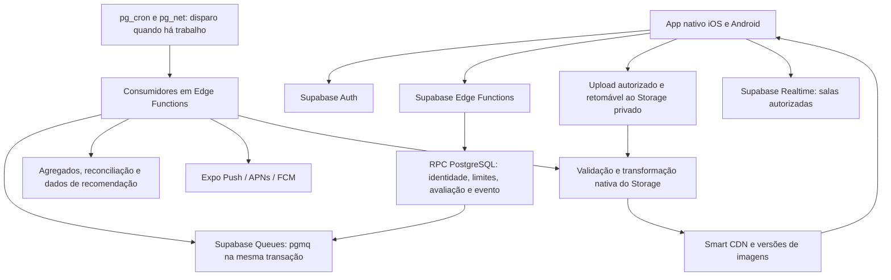

# Tasty nativo — plano revisado com Supabase

Data: 12 de setembro de 2026. Revisão que incorpora a correção de custo-benefício enviada pelo usuário. A arquitetura nativa ainda não foi implementada nem validada por teste de carga. A versão web já utiliza a identidade vermelha.

## Decisões já recebidas

- Identidade visual: substituir verde por vermelho. Cor principal `#C62828`, variação escura `#991F1F`, fundos claros em tons de vermelho e creme. Aplicar também ao novo app nativo.
- Meta de pico aprovada pelo usuário: **10.000 cadastros e 10.000 avaliações durante o mesmo minuto**.
- Gatilho provisório aprovado para avaliar ML: **50.000 interações válidas, 2.000 usuários ativos e 8 semanas de dados**, além de demonstrar melhoria sobre as recomendações por regras.
- Construir o app nativo em um projeto novo. A versão web será referência de produto e modelo de dados, sem copiar sua estrutura React DOM, Vite ou CSS como base do aplicativo.
- Backend inicial exclusivamente com os componentes do Supabase já contratado: Auth, Edge Functions, PostgreSQL, Queues, Storage e Realtime. Expo continua responsável pelo encaminhamento de push.
- Evitar novas faturas de AWS, Redis dedicado ou servidores permanentes. Aumentos de capacidade devem ser sustentados por medições e estimativa de custo incremental.
- O usuário autorizou executar o plano sem novas confirmações rotineiras. Essa instrução substitui o pedido de alinhamento prévio do documento anterior.

O [relatório de plano e custos](CUSTOS_TASTY_SUPABASE.md) registra a consulta à conta, as franquias, exemplos de excedentes e os valores ainda não verificáveis. Ter os recursos disponíveis no Pro não comprova capacidade para o pico escolhido.

## 1. Stack: comparação e recomendação

| Critério                           | React Native + Expo com build próprio                                   | Swift/SwiftUI + Kotlin/Jetpack Compose                                      |
| ---------------------------------- | ----------------------------------------------------------------------- | --------------------------------------------------------------------------- |
| Aplicativo entregue                | Binários iOS e Android com componentes e módulos nativos                | Dois aplicativos construídos diretamente com as ferramentas das plataformas |
| Linguagens                         | TypeScript, com Swift/Kotlin onde houver módulos específicos            | Swift no iOS e Kotlin no Android                                            |
| Interface e regras de apresentação | Grande parte compartilhada                                              | Implementação e manutenção por plataforma                                   |
| Câmera e OCR                       | Módulos nativos; integrações próprias quando necessário                 | Acesso direto às APIs de cada sistema                                       |
| Push e background                  | APIs nativas por módulos; sujeitos às mesmas restrições dos sistemas    | APIs acessadas diretamente, com as mesmas restrições dos sistemas           |
| Manutenção                         | Menor duplicação; exige testar compatibilidade das dependências nativas | Maior controle; exige manter duas interfaces e integrações                  |
| Prazo e custo relativos            | Melhor ponto de partida para uma equipe pequena                         | Maior esforço total; duas equipes podem reduzir o prazo de calendário       |

**Recomendação: React Native com New Architecture, TypeScript e Expo em builds próprios de desenvolvimento e produção.** A interface será construída com componentes nativos, navegação e listas apropriadas para celular. Fabric e módulos nativos permitem integrar recursos da plataforma; Expo oferece ferramentas para compilar e distribuir esses projetos. Essas capacidades estão descritas na [arquitetura do React Native](https://reactnative.dev/architecture/landing-page) e nos [builds de desenvolvimento do Expo](https://docs.expo.dev/develop/development-builds/introduction/).

O produto não depende de uma interface com requisitos que justifiquem, neste momento, duplicar toda a implementação em Swift e Kotlin. Essa é uma avaliação de engenharia para este escopo, não uma garantia de que qualquer biblioteca atenderá sem adaptação. As versões exatas e a compatibilidade dos módulos serão fixadas na fase de viabilidade.

Para a Conta Justa, proponho OCR no dispositivo: Vision no iOS e ML Kit no Android, com uma interface comum e possibilidade de um módulo nativo próprio. A correção manual dos itens permanece obrigatória no fluxo. Ver [OCR do Vision](https://developer.apple.com/documentation/vision/recognizing-text-in-images?changes=lates_7) e [ML Kit Android](https://developers.google.com/ml-kit/vision/text-recognition/v2/android).

Credenciais de sessão usarão armazenamento seguro do sistema. Rascunhos, tarefas pendentes e cache local usarão SQLite. Mapas serão componentes nativos. O desenvolvimento do backend começará com Supabase local e migrações versionadas, evitando criar um projeto remoto pago apenas para iniciar o trabalho. A homologação hospedada terá dados isolados e custo dimensionado antes dos ensaios; nenhum teste de pico será executado sobre os usuários da produção atual.

## 2. Backend com os componentes do Supabase

### Desenho revisado

| Componente anterior                     | Escolha inicial revisada                                                       |
| --------------------------------------- | ------------------------------------------------------------------------------ |
| Fastify em ECS/Fargate                  | Edge Functions para endpoints e orquestração                                   |
| SQS e workers permanentes               | Queues/pgmq e consumidores em Edge Functions, acionados por agendamento        |
| Redis para limites                      | Tabela e função atômica no PostgreSQL                                          |
| Redis para cache                        | Cache local, agregados/candidatos no Postgres e CDN para mídia                 |
| Workers pesados de imagem e CDN própria | Preparação no aparelho, transformação nativa do Storage e Smart CDN            |
| Pooling mantido pela aplicação          | Pool do PostgREST para RPC/REST; Supavisor para eventual SQL direto no backend |

### Escrita, limites e consistência

**Confirmação atômica.** A Edge Function validará o token e chamará uma única função de banco para publicar. Essa transação verificará autorização e limites, gravará a avaliação e registrará o evento durável na fila pgmq. O evento terá identificador, tipo, versão e IDs de usuário/prato/avaliação; fotos não entrarão na mensagem. Se qualquer etapa falhar, toda a transação será revertida. Sucesso HTTP só será enviado após o commit.

Uma restrição única por usuário/operação/chave de idempotência, junto ao hash do conteúdo, impedirá duplicações inclusive em requisições concorrentes. Retry com a mesma chave e conteúdo retornará o mesmo resultado sem consumir novamente o limite. Reutilizar a chave com conteúdo diferente retornará conflito. A mesma disciplina será aplicada a edições, exclusões e ações sociais pertinentes.

Como a fila está no mesmo PostgreSQL, a avaliação e `pgmq.send` podem compartilhar a transação. Não será necessário um segundo despachante apenas para copiar cada evento para outra fila externa. Uma trilha de eventos permitirá auditoria e reconciliação, com retenção limitada. Será usada fila persistente com WAL, nunca a opção não durável para eventos críticos. [Filas e API pgmq](https://supabase.com/docs/guides/queues/pgmq).

**Rate limiting no banco.** Uma tabela privada com chave composta `(user_id, endpoint, janela)` terá incremento condicional atômico dentro da função de escrita. Limites iniciais: 10 avaliações, 60 comentários e 120 ações de curtir/salvar por minuto por usuário. Janelas fixas permitem um pequeno burst na virada do minuto; o teste deve cobrir esse comportamento. Registros vencidos serão removidos em lotes com índice de expiração. Não haverá um contador global bloqueado por todos os usuários.

A Edge Function traduzirá excesso em `429` com `Retry-After`. O controle também existirá na função de banco, para que invocar uma RPC diretamente não permita contorná-lo. A identidade virá da sessão validada; o cliente não escolherá outro `user_id`. Escritas diretas nas tabelas serão fechadas, com RLS, concessões mínimas e funções privilegiadas de escopo restrito. Segredos administrativos ficarão apenas no ambiente do servidor. Limites de autenticação e proteção de endpoints anônimos continuam separados desses limites por usuário.

**Pooling sem serviço novo.** Chamadas REST/RPC com `supabase-js` passam pelo PostgREST e seu pool. Elas não passam automaticamente pelo Supavisor. Se alguma Edge Function precisar executar SQL direto, usará o Supavisor em modo transacional, com uma conexão por instância aquecida como ponto de partida, TLS e prepared statements desativados quando exigido pelo modo escolhido. O aplicativo móvel só usará HTTPS. A concorrência dos consumidores será limitada considerando as conexões de Auth, Storage e PostgREST; um pool não elimina limites de CPU e I/O. [Conexões do Supabase](https://supabase.com/docs/guides/database/connecting-to-postgres).

### Consumidores, recuperação e custo ocioso

pgmq oferece leitura com tempo de invisibilidade, reentrega e operações de confirmação/arquivamento. A política de fila de erro será implementada pela aplicação: após um limite inicial de cinco tentativas, mover a mensagem para uma fila de falhas na mesma transação que a remove da fila ativa. Registrar causa, alertar e permitir reprocessamento. Não presumir que criar uma fila pgmq configura automaticamente dead-letter e retries adequados ao negócio.

Consumidores terão processamento idempotente por `(consumidor, evento)`. Quando o efeito for inteiramente no banco, gravar a deduplicação, aplicar o efeito e confirmar a mensagem na mesma transação. Em uma chamada externa de push, uma queda após o envio pode deixar o resultado incerto; registrar tickets/receipts e deduplicar ao máximo, sem prometer entrega externa exatamente uma vez. Reenvios e eventos fora de ordem não podem duplicar contagens ou desfazer uma versão mais recente.

Filas pgmq não despertam funções por conta própria. O agendamento usará `pg_cron` e `pg_net`, com credenciais no Vault e endpoints de consumo autenticados. O cron verificará se há mensagens elegíveis e vagas de processamento antes de chamar uma Edge Function. Sem trabalho, não haverá invocações Edge de polling contínuo. Começar com verificação por minuto e medir seu impacto no atraso total; agendamento, espera e retries entram na meta de drenagem. [Consumo por Edge Functions](https://supabase.com/docs/guides/queues/consuming-messages-with-edge-functions) e [agendamento nativo](https://supabase.com/docs/guides/functions/schedule-functions).

Cada consumidor começará com lotes de 25–50 mensagens e número limitado de lotes por execução. Leases no banco limitarão a concorrência; expiração permitirá recuperação de instâncias interrompidas. Timeout de visibilidade, tamanho do lote e paralelismo serão ajustados pela medição. Evitar uma chamada HTTP por evento e cadeias recursivas de funções. Não segurar transações SQL abertas enquanto espera upload, e-mail ou push.

Filas, limites, avaliações e agregados compartilham o mesmo banco. Essa escolha elimina serviços separados, mas não o custo de processamento. Monitorar idade da fila, retries, falhas, CPU, disco, I/O, locks e conexões. Arquivos de mensagens processadas e eventos brutos terão retenção e limpeza em lotes para controlar crescimento e manutenção do PostgreSQL.

### Fotos e limites das Edge Functions

Upload continuará direto ao Storage, autorizado e retomável. O aparelho comprimirá a imagem e removerá metadados desnecessários antes de enviar; isso melhora o uso normal, mas o servidor não confiará apenas no cliente. Originais entrarão em área privada, com limites de tamanho/tipo e vínculo ao proprietário. A validação verificará conteúdo compatível com a extensão, dimensões, integridade e destino permitido, mantendo arquivos rejeitados fora da publicação.

**Correção da proposta recebida:** Edge Functions não serão workers de processamento pesado de fotos. O limite documentado é **2 segundos de CPU por requisição**, 256 MB de memória e, no plano pago, até 400 segundos de duração total. Espera de rede não equivale a CPU disponível; bibliotecas multithread como `sharp/libvips` não são suportadas nesse ambiente. Por isso a função coordenará validações limitadas, estados e pedidos ao serviço nativo de transformação. [Limites das Edge Functions](https://supabase.com/docs/guides/functions/limits).

Redimensionamento, qualidade e formato serão tratados pela transformação nativa do Storage. URLs e caminhos versionados serão reutilizados pelo Smart CDN, com poucos tamanhos de feed. A prova de viabilidade deve testar orientação, EXIF/localização, arquivos malformados e limites reais: a documentação de transformação não será interpretada como garantia universal de sanitização. Só a imagem validada poderá ser publicada, e o original permanecerá privado. Se a sanitização necessária não couber nas capacidades comprovadas, registrar essa lacuna antes de liberar fotos; não inserir processamento pesado incompatível na Edge Function. [Transformação de imagens](https://supabase.com/docs/guides/storage/serving/image-transformations) e [Smart CDN](https://supabase.com/docs/guides/storage/cdn/smart-cdn).

A avaliação confirmada poderá apresentar a foto como em processamento, com retomada e indicação de falha. O tempo até a foto ficar disponível será medido separadamente do salvamento de metadados. Transformações nativas têm franquia e excedentes por imagem de origem; não são ilimitadas no Pro.

### Notas, feed, jogos e cadastros

Notas serão agregadas em lotes, incluindo edição/exclusão, sem recontagem integral na requisição de publicação. Deduplicação e controle de versão impedirão aplicar deltas duas vezes. Reconciliar periodicamente com as avaliações persistidas. O teste concentrará escritas em pratos populares para detectar linhas de agregado muito disputadas.

O feed terá paginação por cursor, candidatos pré-calculados no Postgres e cache local SQLite. Tracking seguirá em lotes para sua própria fila pgmq e dados particionados no Supabase. Redis e plataforma analítica externa não farão parte da base inicial. Realtime ficará restrito a salas e usuários interessados, com autorização e recuperação do estado ao reconectar. Milhares de requisições HTTP não exigem milhares de sockets Realtime.

Cadastros continuarão pelo Supabase Auth, com SMTP de produção e quota suficiente no provedor de e-mail. Criar conta, enviar confirmação e confirmar endereço são etapas distintas. Somente perfil mínimo ficará no caminho crítico; notificações e recomendações iniciais serão assíncronas. O serviço padrão de e-mail atual não é uma configuração de lançamento para 10 mil cadastros/minuto. Pooling e troca de fila não removem limites de Auth ou SMTP. [Limites de autenticação](https://supabase.com/docs/guides/auth/rate-limits).

### Meta, latência e teste de carga

A meta permanece **10.000 cadastros e 10.000 avaliações no mesmo minuto**: cerca de 167 cadastros/s e 167 salvamentos/s, ou aproximadamente 334 operações de negócio/s antes de uploads, leituras, confirmação, curtidas e tracking. Isso não significa apenas 334 consultas SQL/s.

Os critérios permanecem:

| Critério                | Aceite                                                                                                |
| ----------------------- | ----------------------------------------------------------------------------------------------------- |
| Salvamento de metadados | p95 até 1,5 s e p99 até 3 s, medidos pelo cliente de teste até a confirmação durável                  |
| Erros inesperados       | Menos de 1% das operações válidas                                                                     |
| Integridade             | Nenhum registro confirmado perdido e nenhum duplicado por retry                                       |
| Filas                   | Drenagem até 5 minutos após o pico, sem crescimento ilimitado                                         |
| Mídia e e-mail          | Métricas próprias de upload, foto pronta, envio e confirmação; não esconder esses tempos no resultado |

**Reavaliação antes do teste pago:** p95/p99 são objetivos plausíveis para uma escrita pequena e uma única RPC, mas ainda não há evidência de que sejam atingidos no compute atual, especialmente com Auth e consumidores concorrendo por recursos. Incluir partidas frias e filas de conexão na medição. Não declarar a capacidade aprovada apenas com funções já aquecidas, médias ou testes locais.

Não é viável exigir processamento pesado de uma foto arbitrária dentro dos 2 segundos de CPU da Edge Function. A meta de salvamento já separa mídia do caminho crítico; o novo desenho preserva isso. Também não é viável demonstrar 10 mil cadastros/minuto com o serviço padrão de e-mail e seus limites atuais. São restrições conhecidas de configuração e fluxo, sem redução da meta de negócio.

O prazo de drenagem depende do número de tarefas geradas por publicação, não apenas do número de avaliações. A 500 push/s, cinco minutos comportam no máximo 150 mil envios, antes de retries e outras esperas. O ensaio deve incluir a distribuição real de seguidores e o agrupamento da seção 3; não aprovar uma fila artificialmente pequena enquanto o produto produz fan-out ilimitado.

Premissa de mídia: uma foto de 2 MB por avaliação, equivalente a **20 GB de upload em um minuto**, cerca de 333 MB/s recebidos pelo Storage. Quinze minutos nessa taxa representam 300 GB de originais. Essa carga não prova ser necessária no uso cotidiano; é o envelope de validação solicitado. Não encaminhar esses bytes pelas Edge Functions.

O roteiro de homologação usará contas e destinatários controlados:

1. Validar localmente migrações, autorização, transação, idempotência concorrente, limites e recuperação de filas. Medir custo por operação em ensaio hospedado pequeno antes da carga completa.
2. Conferir compute real, quotas de Auth/SMTP/Storage/Functions/Realtime e orçamento do ensaio. Instrumentar custo e condições de interrupção antes de executá-lo. Interromper a etapa quando houver degradação ou orçamento esgotado registra falha, não aceite parcial.
3. Subir em estágios de 1.000, 2.500, 5.000 e 10.000 operações por tipo/minuto, até atingir cadastros e avaliações simultâneos na meta. Cadastros devem usar a API pública real e origens de teste controladas, sem substituir o fluxo por criação administrativa.
4. Publicar com usuários já autenticados e também com contas recém-confirmadas, junto a uploads e leituras. Medir criação, envio de e-mail e confirmação separadamente; registrar `429` de usuários dentro da quota como incapacidade de atender a carga, não descartá-los das estatísticas.
5. Alternar distribuição normal e concentração em poucos pratos; testar cold starts, perda de resposta após commit, interrupção de consumidores, expiração de leases, reentrega, fila de falhas e falhas de rede.
6. Executar o pico de um minuto e a carga sustentada de 15 minutos. Conferir contagens e hashes de operações persistidas, reconciliação dos agregados e fila vazia/estabilizada após a drenagem, sem encerrar a medição na última resposta HTTP.
7. Registrar percentis, operações rejeitadas, idade das filas, CPU/I/O/locks/conexões e custo por mil operações. Remover os dados de teste ao terminar, preservando o relatório sem dados pessoais.

Não há benchmark que permita afirmar que o Pro atual atende ao pico ou que essa combinação terá sempre menor latência/custo que infraestrutura dedicada. A decisão inicial reduz fornecedores e despesas fixas adicionais; capacidade e custo sob carga continuam sujeitos aos ensaios.

### Plano contratado, custo e eventual evolução

A consulta autenticada confirmou **Supabase Pro**, em uma organização com seis projetos. O Tasty tem aproximadamente 12 MB de banco, nenhuma Edge Function implantada e as extensões pgmq/pg_cron/pg_net disponíveis, ainda não habilitadas. Compute exato e consumo acumulado da organização não foram confirmados. Não será necessário mudar para Team apenas para disponibilizar os componentes escolhidos.

Pro inclui 2 milhões de invocações Edge, 100 GB de Storage e 100 origens distintas transformadas por ciclo; transformar 10 mil origens gera aproximadamente US$ 50 de excedente quando toda a franquia inicial está disponível. Esses exemplos não representam saldo confirmado nem a fatura real dos seis projetos. Franquias, cenários e eventuais incrementos de compute estão no [relatório de custos](CUSTOS_TASTY_SUPABASE.md).

A fase de viabilidade começará sem contratar AWS, Redis externo ou servidor novo. Antes de concluir que falta capacidade, ajustar índices, consultas, retenção, lotes e concorrência. Aumentar compute ou quota do Supabase só responde ao gargalo que for medido; trocar o plano da organização não garante throughput.

Upstash só será considerado se a tabela de limites continuar causando contenção material após esses ajustes. Fila externa só será considerada se o uso compartilhado de CPU/I/O/disco do pgmq impedir a meta e a alternativa tiver custo-benefício demonstrado. A ordem de evolução seguirá o gargalo observado, preservando transações, IDs de evento, idempotência e reconciliação. Nenhuma dessas alternativas integra a contratação inicial.

## 3. Push funcional e deep links

**Serviço proposto:** `expo-notifications` no app e Expo Push Service no backend, encaminhando para APNs e FCM. É necessário configurar as contas de desenvolvedor, os identificadores dos aplicativos e as credenciais de cada plataforma.

| Evento confirmado no backend | Destino ao tocar na notificação         |
| ---------------------------- | --------------------------------------- |
| Curtida em uma avaliação     | A avaliação correspondente              |
| Comentário                   | A avaliação, com o comentário destacado |
| Novo seguidor                | O perfil de quem começou a seguir       |
| Resultado de uma sala        | A sala e o resultado persistido         |

Tokens serão vinculados a usuário, aparelho e ambiente, atualizados quando mudarem e desvinculados no logout. O worker verificará preferências, bloqueios e deduplicação antes do envio. As notificações carregarão identificadores, nunca uma URL arbitrária a ser executada. O app validará a rota e, se necessário, fará login antes de abrir o conteúdo autorizado. Links externos terão Universal Links no iOS e App Links no Android.

O pipeline tratará tickets, receipts, erros transitórios e tokens inválidos. Um receipt de sucesso comprova encaminhamento ao serviço da plataforma, não leitura nem exibição garantida no aparelho. [Envio e tratamento de resultados](https://docs.expo.dev/push-notifications/sending-notifications/).

O limite documentado do Expo Push Service é 600 notificações/s por projeto. Proponho consumir até 500/s inicialmente, com fila e agrupamento de interações; novos posts não dispararão automaticamente para todos os seguidores. Se a demanda sustentada superar o limite ou o atraso contratado, o adaptador poderá migrar para envio direto APNs/FCM. [Limite do Expo](https://docs.expo.dev/push-notifications/faq/).

O aceite exige receber eventos reais em um iPhone e um Android físicos e verificar a abertura correta com app aberto, em segundo plano e iniciado pelo toque da notificação. Registrar a notificação no banco, obter token ou receber um ticket isoladamente não encerra esse teste.

## 4. Execução em segundo plano por plataforma

| Necessidade                     | iOS                                                                                     | Android                                                                       |
| ------------------------------- | --------------------------------------------------------------------------------------- | ----------------------------------------------------------------------------- |
| Sincronização periódica         | BGTaskScheduler escolhe quando conceder execução                                        | WorkManager agenda trabalho, sujeito a bateria, rede e restrições do aparelho |
| Atualização por push silencioso | Melhor esforço; o sistema pode adiar ou não entregar                                    | Melhor esforço, sujeito à prioridade, economia de energia e estado do app     |
| Upload iniciado pelo usuário    | Transferência nativa em background quando suportada e validada, com rascunho persistido | Trabalho retomável via WorkManager e mecanismo adequado ao tamanho/duração    |
| App encerrado pelo usuário      | Não depender de execução automática para concluir o fluxo                               | Force-stop e restrições de fabricantes podem impedir execução                 |
| Retorno ao app                  | Reconciliar com o servidor e retomar pendências                                         | Reconciliar com o servidor e retomar pendências                               |

No Android, o intervalo mínimo de trabalho periódico do WorkManager é 15 minutos, mas o horário exato não é garantido. [Agendamento no Android](https://developer.android.com/develop/background-work/background-tasks/persistent/getting-started/define-work).

No iOS, push silencioso é de baixa prioridade e tem execução curta; a Apple não garante sua entrega. Não usaremos uma notificação silenciosa para cada curtida nem prometeremos processamento contínuo. [Limites de atualização em background no iOS](https://developer.apple.com/documentation/usernotifications/pushing-background-updates-to-your-app?changes=latest_minor).

O Expo BackgroundTask usa as APIs desses sistemas e herda suas restrições. Será usado para pequenas reconciliações e envio de eventos em lotes, sem manter sockets de jogos ativos continuamente. [BackgroundTask](https://docs.expo.dev/versions/latest/sdk/background-task/).

**Compromisso de produto:** rascunhos e identificadores de operações ficam persistidos; o servidor confirma escritas duráveis; ao reabrir o app com conexão válida, ocorre reconciliação. Horário exato de tarefas, push silencioso e continuidade após encerramento forçado são de melhor esforço. OCR será feito com o usuário na tela, com correção manual; o processamento remoto de fotos usará o serviço nativo do Storage descrito na seção 2.

## 5. Tracking e evolução da recomendação

### Fase 1 — dados desde o lançamento

Registrar `feed_impression`, `dish_view`, `restaurant_view`, `search_submitted`, `search_result_clicked`, `like_added/removed`, `bookmark_added/removed`, `checkin_created`, `review_created` e `recommendation_clicked`.

Cada evento terá identificador único, versão do esquema, usuário ou sessão pseudonimizada, data do evento e de recebimento, item/categoria, origem da tela e posição na lista quando aplicável. Impressões precisam de um critério de visibilidade; curtidas, salvos e publicações serão confirmados pelo servidor para evitar aprendizado a partir de ações que falharam.

O app enviará lotes com deduplicação e limite de armazenamento local. Eventos comportamentais seguirão para uma fila pgmq própria e tabelas particionadas no Postgres, com arquivamento no Storage quando necessário; não criaremos um trigger pesado em cada interação do banco transacional. Dados agregados de preferências alimentarão as recomendações. Essa implementação usa o Supabase, preservando os eventos e os critérios de evolução abaixo.

Buscas terão normalização e remoção de dados pessoais desnecessários. Não coletaremos localização precisa contínua. Proponho retenção inicial de eventos brutos por 90 dias, controles de personalização e exclusão vinculada à conta; a política final será documentada antes do lançamento.

### Fase 2 — regras e similaridade de conteúdo

Começar por categoria do prato, faixa de preço, região quando autorizada, notas com quantidade mínima de avaliações, recência e variedade. Balancear exploração com afinidades recentes. Usuários novos receberão sugestões por contexto e interesses escolhidos, sem depender de histórico inexistente. Quando houver sobreposição suficiente, incluir afinidade entre usuários. Não apresentar essa etapa como um modelo de ML treinado.

### Fase 3 — ML condicionado a evidência

O gatilho provisório acordado é: pelo menos 50.000 interações válidas, 2.000 usuários ativos e 8 semanas de coleta. Proponho definir ativo como usuário com interação válida nos últimos 30 dias. Atingir números inicia a avaliação de viabilidade; não determina automaticamente a troca do algoritmo.

Antes da ativação: verificar distribuição entre usuários e pratos, excluir contas de teste/fraude, respeitar remoções e consentimentos, avaliar cobertura e separar treino/teste por tempo. Um grande número de visualizações repetidas não substitui sinais úteis de preferência. Comparar regras com collaborative filtering ou embeddings, conforme os dados disponíveis.

Aprovar o modelo somente se melhorar métricas offline de ranking e depois um experimento controlado de cliques/salvos, sem piorar diversidade, latência e experiência de usuários novos. O tamanho da amostra do experimento será calculado após medir a taxa de uso; 50.000 eventos não garantem significância estatística. Manter retorno imediato às regras. Esses limites são uma hipótese de produto acordada, não um mínimo universal de ML.

## 6. Fases de entrega e critérios de saída

Estimativa de planejamento para **um desenvolvedor mobile, um backend e apoio de QA/design**, com acesso às contas e aparelhos. Não é orçamento fechado nem prazo já assumido. Revisões das lojas, quotas, contratação e credenciais podem acrescentar espera.

| Fase                    | Esforço de calendário indicativo | Entrega verificável                                                                                                                                   |
| ----------------------- | -------------------------------- | ----------------------------------------------------------------------------------------------------------------------------------------------------- |
| Viabilidade e contratos | 1–2 semanas                      | Validar módulos de câmera/OCR/push, quotas, modelo de carga, arquitetura e orçamento; ensaio inicial do caminho de escrita antes de expandir as telas |
| Fundação                | 2–3 semanas                      | Projeto nativo novo, identidade vermelha, login, armazenamento seguro, navegação, API, banco, fila, observabilidade e tracking básico                 |
| MVP social nativo       | 4–6 semanas                      | Feed, seguir, comentar, avaliar com foto, busca/filtros/ranking, mapa, check-in, salvos, push real com deep link e recomendações por regras           |
| Paridade funcional      | 3–4 semanas                      | Conta Justa com OCR nativo, jogos e salas, retomada de operações e ajustes de background                                                              |
| Validação e publicação  | 2–3 semanas                      | Testes em dispositivos, isolamento dos dados, recuperação de falhas, pico completo de 10 mil + 10 mil/minuto e pacotes para TestFlight/Google Play    |

Total indicativo sequencial: **12–18 semanas** para o escopo completo, antes de atrasos externos. O MVP social ocupa aproximadamente 7–11 semanas e ainda não encerra a paridade solicitada: OCR da Conta Justa e jogos continuam no escopo completo. Alguns trabalhos podem se sobrepor, mas isso será reestimado com a equipe real. Com uma única pessoa, o calendário tende a aumentar.

Uma implementação Swift + Kotlin exigiria duas frentes de interface e integração. Como hipótese de orçamento, estimaria esforço mobile total de 1,5 a 2 vezes o React Native para este escopo, com o backend essencialmente igual. Não considero esse multiplicador uma medida universal; equipes especialistas paralelas podem reduzir o prazo, com custo maior.

ML de recomendação entra depois, apenas quando atingir o gatilho e passar na comparação. Não deve bloquear o lançamento. Cadastro/login social nativo fica preparado na base; ativação depende das credenciais e validação em ambas as plataformas.

## Diretriz de execução

O usuário autorizou seguir este plano sem novas confirmações rotineiras. A execução começará pela viabilidade e pelo projeto nativo separado, seguindo React Native + Expo, identidade vermelha e backend Supabase. Permanecem a meta de pico, o gatilho provisório de ML, push real, OCR no aparelho, limites de background e as fases de entrega.

Essa autorização não transforma estimativas em capacidade comprovada nem elimina a diretriz de custo: usar primeiro o que já foi contratado, calcular excedentes antes dos ensaios e evitar nova despesa fixa sem evidência. Limitações de acesso ou de credenciais serão comunicadas com a causa concreta, prosseguindo com o trabalho independente que estiver disponível.

Esta revisão entrega arquitetura e análise de custos. Nenhum app nativo, fila nova, teste de pico ou alteração da arquitetura de produção foi implantado por ela.
